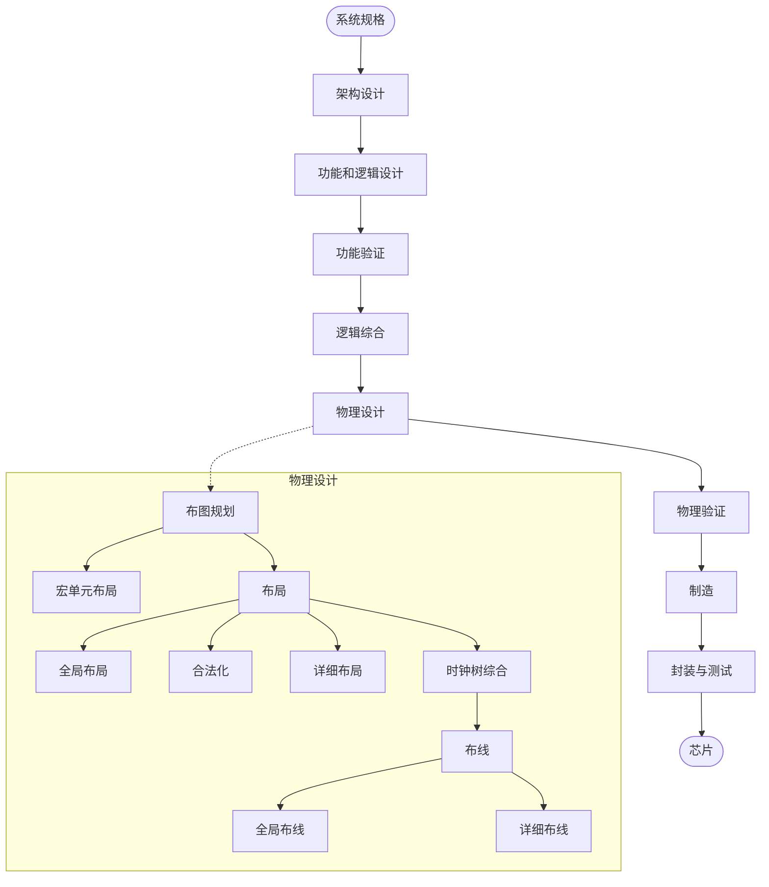
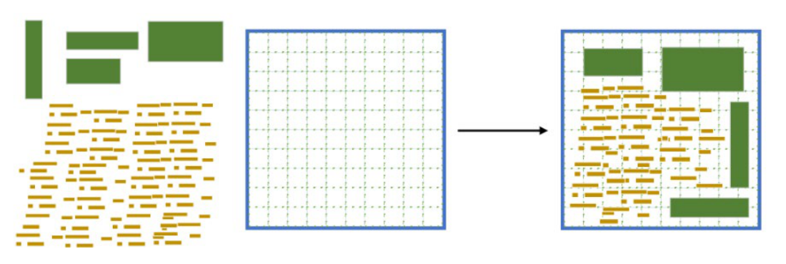
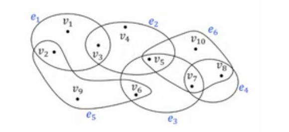

# 布局基础

## 1. 芯片物理设计

物理设计是芯片设计中最为耗时的关键环节，它将所有组件映射到物理布局中。物理设计的最终优化目标是可制造性和功能正确性。可制造性要求单元、线不重叠且不超出芯片范围，功能正确性涵盖布线连通无短路、满足时序收敛，通过设计规则检查，保障布线正确且符合制造要求。物理设计流程主要分为布图规划、布局、时钟树综合、布线等四步，如图 1-1 所示。

图 1-1 芯片物理设计流程图

布局过程如 1-2 所示。布局可进一步被细分为全局布局、合法化、详细布局三个阶段。

图 1-2 布局过程

（1）全局布局（Global Placement，GP）

全局布局阶段旨在确定各个组件的大致位置，此位置为满足连线线长和单元密度等约束条件下每个组件的最佳位置。全局布局允许单元在一定程度上重叠，且不考虑放置位置的合法性。

（2）合法化（Legalization，LG）

合法化阶段旨在将全局布局结果中的不合法布局转化为合法状态，主要通过将每个标准单元放置到行中并对齐位置，同时消除单元重叠及其他违反布局规则的问题。

（3）详细布局（Detailed Placement，DP）

详细布局指在合法化规则约束下，以合法化处理结果为基础对布局实施进一步优化的过程。该阶段通过将标准单元移动至附近的合法位置，结合拥塞、时序等约束条件开展局部优化。

## 2 布局单元

在芯片布局问题里，有五种不同的单元：标准单元、宏单元、填充单元、终端单元和暗节点单元。其中标准单元、宏单元、填充单元是可移动的，布局的目标即是确定它们的位置。终端单元和暗节点单元为不可移动的，具体如表 1-1 所示。

表 1-1 标准单元、宏单元、填充单元、终端单元和暗节点单元

| 英文（工具/文献常见叫法） | 中文译名 | 一句话功能描述 |
| --- | --- | --- |
| Standard Cell | 标准单元 | 实现基本逻辑/时序功能（如 NAND、DFF），高度固定、宽度为 site 的整数倍，按行对齐摆放。 |
| Macro / Hard Macro | 宏单元（或硬核 IP） | 大尺寸的存储器、模拟 IP 等（如 SRAM、PLL），形状任意，通常优先定位后作为整体参与布局。 |
| Filler Cell | 填充单元 | 填满行内空隙，保证 N-well/注入层与电源轨（VDD/VSS）的连续性、减少 base 层 DRC 违规，无逻辑功能。 |
| End-Cap / Boundary Cell | 终端单元（端帽单元） | 放在标准单元行两端，提供行端 N-well 与电源/地的封闭及边界 DRC 保护，防止行边缘单元受损。 |
| Dark Node | 暗节点 | 位于布局网格内但不属于任何可放置区域（placement region）的"占位"矩形，处理方式与固定节点相同，仅因密度计算需要而存在。 |

（原 PDF 中该表格超出页面右边界，第三列部分内容被页面边缘截断；截断处已根据 ePlace 论文（Lu et al., ACM TODAES 2015）及 VLSI 物理设计公开资料补全。）

注： ePlace 论文（2015-ACM-ePlace Electrostatics-Based Placement Using Fast Fourier）中将终端视为不可移动的宏块。

## 3. Mixed-size placement（混合尺寸布局）

Mixed-size placement 是集成电路物理设计中的一个关键步骤，它要求在芯片内有效放置不同尺寸的模块，如宏单元（macros）和标准单元（standard cells）。其最终目标是优化芯片的性能（Performance）、功耗（Power）和面积（Area），即 PPA。

在实际生产过程中，宏单元和标准单元的放置相互影响，对整个芯片布局的质量起着至关重要的作用，从而决定了芯片物理实现的最终质量。例如，在一些常用的开源工具中，如 OpenROAD，采用两阶段放置方法进行芯片放置。首先，在 floorplanning 阶段，系统划分网表并确定宏单元的位置；然后，在 placement 阶段，固定宏单元的位置，专注于标准单元的放置。然而，这种策略往往在放置宏单元时未能充分考虑标准单元信息，且在标准单元放置阶段难以相应地调整宏单元位置，导致这两个阶段之间存在不匹配。

混合尺寸布局的挑战主要在于宏单元和标准单元之间存在较大的尺寸差异，这使得放置过程比标准单元放置要困难得多。为了解决这一问题，研究人员探索了多种混合尺寸放置技术，以同时优化宏单元和标准单元的位置。典型的混合尺寸放置算法利用数学优化方法，如 mPL6、NTUplace、ePlace-MS 等。这些算法通过不同的优化策略和数据结构，来提高布局的效率和质量。

ePlace-MS 是一种基于静电学的大规模混合尺寸电路布局算法。它通过扩展密度建模方法来处理混合尺寸布局，使用 Nesterov 方法作为非线性求解器，并开发了近似非线性预处理器以最小化宏单元和标准单元之间的拓扑和物理差异。在实验中，ePlace-MS 在多个现代混合尺寸基准电路上的性能优于所有相关工作，与领先的混合尺寸布局工具 NTUplace3 相比，平均缩短了 8.22%的线长，且运行时间相同。

总的来说，混合尺寸布局是集成电路设计中的一个重要环节，它需要综合考虑多种因素，以实现芯片性能、功耗和面积的优化。随着集成电路设计的复杂度不断增加，混合尺寸布局技术也在不断发展和创新，以满足日益增长的设计需求。

## 4. 布局目标

电路可用超图模型来描述。

（1）图（Graph）：

- 图是由顶点（vertices）和边（edges）组成的，其中边是连接两个顶点的线段。
- 在图论中，边是二元关系，即每条边连接两个顶点。

（2）超图（Hypergraph）：

- 超图是图的一种推广，其中"边"（称为超边）可以连接任意数量的顶点，而不仅仅是两个。
- 在超图中，超边可以包含一个顶点、两个顶点，或者更多的顶点。

在集成电路设计中，使用超图而不是普通图是因为某些设计约束可能涉及到多个元件（顶点）之间的关系，而不仅仅是两个元件之间的关系。例如，在布局问题中，可能需要考虑多个元件之间的距离约束，这就需要用到超边来表示，模型示意如图 1-3 所示。

图 1-3 超图模型

通常电路可建模成超图 $G=(V, E, R)$。其中顶点集合 $V=\{v_1, v_2, v_3, \ldots\}$ 为宏块或标准单元的 pin；$E=\{e_1, e_2, e_3, \ldots\}$ 为 Net 集合，其 $e_k$ 为相连的顶点 $v$ 组成的一个 Net。

对第 $k$ 个 Net, 即 $e_k$，其线长模型为最常见为半周长线长（Half-Perimeter Wirelength, HPWL）：

$$HPWL_e(\mathbf{v}) = \max_{i,j \in e} |x_i - x_j| + \max_{i,j \in e} |y_i - y_j|. \tag{1}$$

其中 $(x_i, y_i)$ 和 $(x_j, y_j)$ 分别为子网 $e_k$ 中的顶点 $i$ 和 $j$ 的布局位置坐标。它表示了这个网络的最小包围矩形的周长一半，也就是连线在平面上可能占据的最小距离范围。这样，整个布局的，总线长为

$$HPWL(\mathbf{v}) = \sum_{e \in E} HPWL_e(\mathbf{v}) \tag{2}$$

**布局的目标是在无单元重叠的约束下进行线长最小化。** 在真实芯片中，HPWL 与布线实际长度高度相关，因此被广泛用作优化目标。

本设计重点为全局布局，该步骤采用混合尺寸布局的方式进行，即宏单元和标准单元一起参与布局。设计的输入为 BookShelf 格式的电路描述文件，其中定义了布局区域、电路单元（包括可移动的和不可移动的）的高度和宽度及单元之间的连接关系、不可移动的终端位置等，布局的目标即是确定可移动标准单元和宏块的位置。

为了加快全局布局的收敛速度，在全局布局之前，进行了一个初始布局，为全局布局提供一个初始值，即初始布局给出可移动标准单元和宏块的初始位置。
