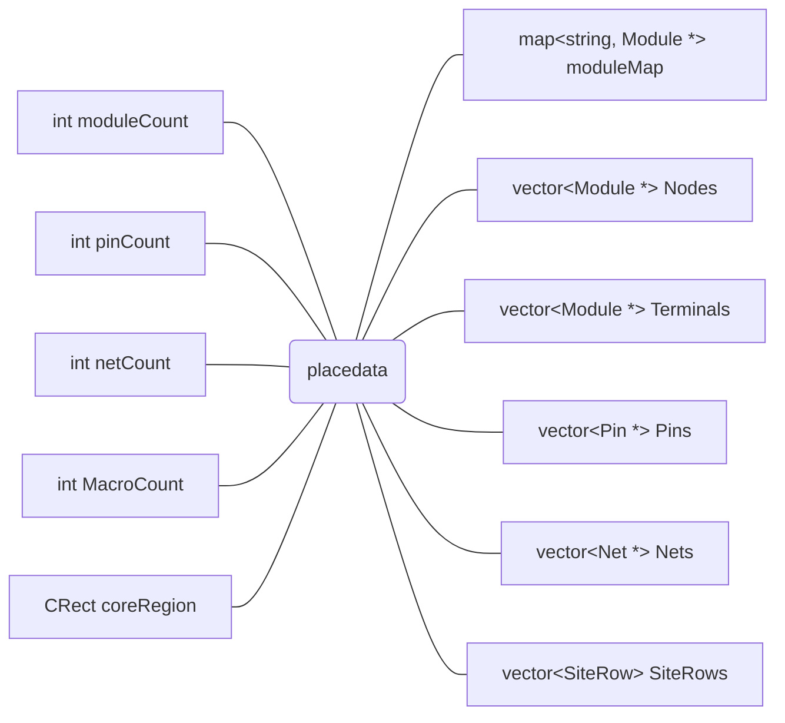
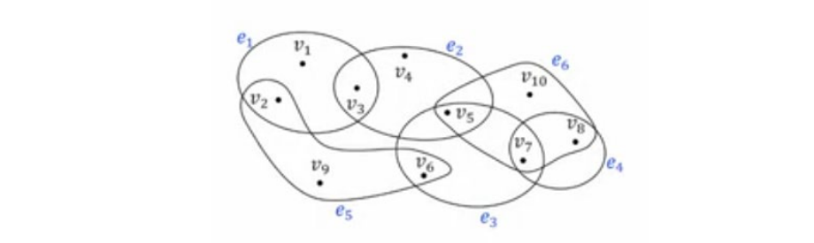

# 布局数据文件解析

## 1. 数据结构设计



### 1）Module

对应将布局对象-布局单元，布局单元有可以移动的，也有固定的，可以移动的对应待布局的单元 Node (包含 Standard cell 或 Macro cell)，固定的对应终端 Terminal。具体是哪种单元，在 BookShelf 文件的\*.node 文件中定义，具体是否固定，在 BookShelf 文件的\*.pl 文件中定义。

Stand-cell 与 Macro cell 的区别为：

表格

| 类型 | Standard Cell | Macro Cell |
| ---- | ------------- | ---------- |
| 定义 | 预定义的小型逻辑单元 (如NAND、D触发器) | 大型、复杂的定制模块 (如SRAM、PLL、ADC) |
| 用途 | 实现通用逻辑功能 | 实现特定功能 (存储、时钟、模拟等) |
| 例子 | AND2、OR4、DFF、MUX | SRAM、ROM、PLL、SerDes、ADC、DAC |

参考属性定义：

```cpp
int idx;
Tier *tier;
string name;
float width;
float height;
float area;
float orientation;
bool isMacro;
bool isFixed;
bool isNI;
bool isFiller;
vector<Pin *> modulePins;
vector<Net *> nets;
```

其中，modulePins 为布局单元引脚的链表，nets 为布局单元所在网络的链表。

### 2）Pin

对应布局单元的引脚，参考属性定义：

```cpp
int idx;
Module *module;
Net *net;
POS_2D offset;
int direction; // 0 output  1 input  -1 not-define
```

其中，idx 为引脚的编号，offset 为引脚位置相对于中心的偏移。

### 3）Net

- 超图模型

  （1）图 (Graph) :

  - 图是由顶点 (vertices) 和边 (edges) 组成的，其中边是连接两个顶点的线段。
  - 在图论中，边是二元关系，即每条边连接两个顶点。

  （2）超图 (Hypergraph) :

  - 超图是图的一种推广，其中“边” (称为超边) 可以连接任意数量的顶点，而不仅仅是两个。
  - 在超图中，超边可以包含一个顶点、两个顶点，或者更多的顶点。

在集成电路设计中, 使用超图而不是普通图是因为某些设计约束可能涉及到多个元件 (顶点) 之间的关系，而不仅仅是两个元件之间的关系。例如，在布局问题中，可能需要考虑多个元件之间的距离约束，这就需要用到超边来表示，模型示意如图 3-1 所示。



图 3-1 超图模型

对应一组相互连接的单元，如图 3-1 有 5 个网络。

参考属性定义：

```cpp
int idx;
vector<Pin *> netPins;
```

### 4）SiteRow

对应布局栅格位置定义，见在 BookShelf 文件的\*.scl 文件中定义。

参考属性定义：

```cpp
double bottom;               // The bottom y coordinate of this SiteRow of sites
double height;               // The height of this SiteRow of sites
double step;                 // The minimum x step of SiteRow.
POS_2D start;                // lower left coor of this row;
 POS_2D end;                 //! lower right coor of this row;
 ORIENT orientation;         // donnie 2006-04-23  N (0) or S (1)
 vector<Interval> intervals;
```

## 2. 数据对照

对 adaptec1，程序读入后，输出文件信息，可对照如下数据：

- Overview:

```text
Core region: lower left: (459,459) to upper right: (11151,11139)
Row Height/Number: 12 / 890 (site step 1.000000)
Core Area: 114190560 (1.14191e+08)
Cell Area: 37286292 (32.65%)
Movable Area: 37286292 (32.65%)
Fixed Area: 64093992 (56.13%)
Fixed Area in Core: 49164072 (43.05%)
Placement Util.: 57.34% (=move/freeSites)
Core Density: 75.71% (=usedArea/core)
Cell #: 210904 (=210k)
Object #: 211447 (=211k) (fixed: 543) (macro: 0)
Net #: 221142 (=221k)
Max net degree=: 2271
Pin 2 (117104) 3-10 (86566) 11-100 (17470) 100- (2)
Pin #: 944053
```

- Bin Setting:

```text
Bin dimension: [512,512]
coreRegion width: 10692
coreRegion height: 10680
Bin step: [20.8828,20.8594]
Bin add time: 0.066442
```
