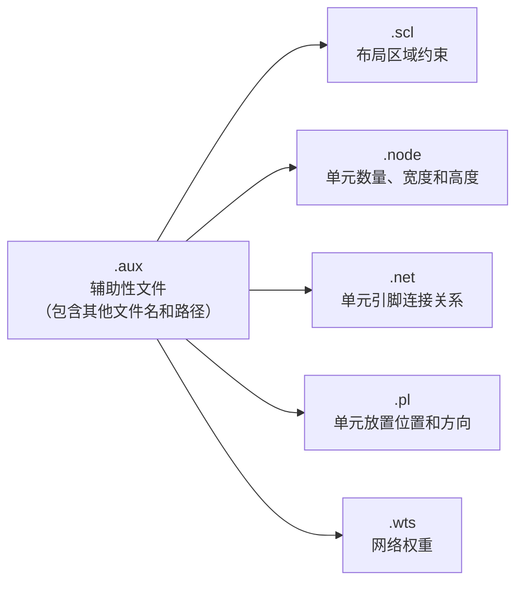

# BookShelf 格式的解析

## 1. 概述

BookShelf 格式是一种用于集成电路（IC）设计领域中布局布线（Place and Route）过程的数据格式。它主要用于描述电路的布局和布线信息，方便不同的设计工具之间进行数据交换和处理。

一个 BookShelf 描述通常包括 6 种类型，如表 1 所示。

**表 1 BookShelf 描述文件**

| 文件类型 | 功能描述 |
| --- | --- |
| .aux | 辅助性文件，包含其他基础文件名和文件路径 |
| .scl | 定义布局区域的约束（核心布局区域范围等信息） |
| .node | 定义电路中的单元数量，以及每个单元的宽度和高度信息 |
| .net | 描述单元之间的连接关系，内容包括网表内的单元引脚连接信息 |
| .pl | 记录单元的放置位置和方向 |
| .wts | 定义网络的权重等信息 |

各文件之间的关系如下图所示（.aux 作为辅助性文件，指向其他 5 个基础文件）：



如 adaptec4 的 BookShelf 文件包实际文件为：

```text
adaptec4.aux
adaptec4.nets
adaptec4.nodes
adaptec4.pl
adaptec4.scl
adaptec4.wts
```

以下以 adaptec4 为例进行说明。

### 1.1 .aux 文件

- **用途**：辅助性文件，包含其他基础文件的名称和文件路径。
- **内容**：
  - 指定其他相关文件（如 .scl、.node、.net、.pl、.wts 等）的路径和名称。
  - 例如：adaptec4.aux 文件内容为

```text
RowBasedPlacement : adaptec4.nodes adaptec4.nets adaptec4.wts adaptec4.pl adaptec4.scl
```

### 1.2 .scl 文件（Standard Cell Library）

- **用途**：定义布局区域的约束，包括核心布局区域、禁止放置区域范围等信息。
- **内容**：
  - 定义布局区域的边界、行间距、单元间距等。
  - 例如：

```text
NumRows : 1944

CoreRow Horizontal
    Coordinate  :  58
    Height      :  12
    Sitewidth   :  1
    Sitespacing :  1
    Siteorient  :  1
    Sitesymmetry:  1
    SubrowOrigin:  7807   NumSites  :  15120
End
CoreRow Horizontal
    Coordinate  :  70
    Height      :  12
    Sitewidth   :  1
    Sitespacing :  1
    Siteorient  :  1
    Sitesymmetry:  1
    SubrowOrigin:  7807   NumSites  :  15120
```

- NumRows 表示行的总数量为 1944。
- Coordinate : 58 表示单元行的起始坐标 Y，因为该行为水平方向。
- Height : 12 说明单元行的高度为 12。
- Sitewidth : 1 单个“Site”的宽度（Site 是布局的最小单位，标准单元按 Site 对齐）
- Sitespacing : 1 Site 之间的间距（通常与 Sitewidth 一致，保证连续布局）
- Siteorient : 1 Site 方向（1 表示水平方向，0 可能垂直，需看工具定义）
- Sitesymmetry : 1 Site 对称性（1 表示对称，辅助镜像布局）
- SubrowOrigin : 7807 说明子行起始偏移
- NumSites : 15120 该行包含的 Site 总数。

其中 site 指的是芯片布局区域中预定义的物理位置单位，是不可见的虚拟网格。

在 ePlace 程序实现中，根据 NumRows、Height、Numsites、Coordinate、Sitewidth 数据，可以得到布局核心区域范围大小。

### 1.3 .node 文件

- **用途**：定义电路中的单元数量，以及每个单元的宽度和高度信息。
- **内容**：
  - 列出每个单元的名称、宽度和高度。
  - 例如：`u1 10 20`

u1 是单元名称，10 是宽度，20 是高度。

```text
NumNodes     :   496045
NumTerminals :     1329
o0   8  12
o1   8  12
o2   3  12
o3   3  12
o4   3  12
o5   3  12
o6   8  12
o7   3  12
o8   10 12
o9   10 12
o10  21 12
o11  24 12
o12  24 12
o13  18 12
o14  18 12
o15  24 12
o16  9  12
o17  26 12
o18  28 12
o19  28 12
o20  22 12
o21  8  12
o22  8  12
o23  22 12
o24  28 12
o25  28 12
```

- NumNodes 表示单元（普通单元和终端单元）总数。
- NumTerminals 指明终端节点数为 1329，终端单元包括芯片引脚、连接器接口等。
- 第 2、3 列数据分别表示单元的宽度和高度。标准单元的高度必须和 site 高度（当前输入 site 高为 12、宽为 1）一致，宽度为 site 宽度的倍数。

```text
o496037  726  1068  terminal
o496038  2173 1092  terminal
o496039  506  1032  terminal
o496040  506  2148  terminal
o496041  726  1068  terminal
o496042  1094 1644  terminal
o496043  1094 1644  terminal
o496044  1094 1644  terminal
```

terminal 表明当前 node 为终端，终端位置是固定的。

### 1.4 .net 文件

- **用途**：定义了芯片布局中的网（Net）信息。每个网（Net）表示一组需要连接在一起的引脚（Pin），这些引脚可能属于不同的标准单元或宏单元。
- **内容**：
  - 列出每个网络（net）的名称和连接的单元引脚。

```text
NumNets : 515951
NumPins : 1912420

NetDegree : 1    n0
    o494716 I : -96.000000  -195.000000
NetDegree : 1    n1
    o494716 O : -96.000000  21.000000
NetDegree : 11   n2
    o441521 I : -9.500000   -6.000000
    o399655 O : -1.500000   1.000000
    o495379 I : 235.000000  33.000000
    o495378 I : 239.000000  -46.000000
    o495377 I : 235.000000  33.000000
    o495376 I : 239.000000  -46.000000
    o495375 I : 235.000000  33.000000
    o495374 I : 239.000000  -46.000000
    o495371 I : 235.000000  33.000000
    o495370 I : 239.000000  -46.000000
    o494717 I : 222.000000  -51.000000
NetDegree : 1    n3
    o494717 I : -96.000000  -87.000000
NetDegree : 2    n4
    o470143 O : -5.500000   -2.000000
    o494717 I : 233.000000  -48.000000
NetDegree : 171  n5
    o495418 I : 190.000000  36.000000
    o495416 I : 190.000000  36.000000
    o495414 I : 190.000000  36.000000
    o495412 I : 190.000000  36.000000
    o495410 I : 190.000000  36.000000
    o495408 I : 190.000000  36.000000
```

- NumNets：表示网络总数。
- NumPins：表示引脚总数。
- 网络结构：每个网络由 NetDegree 标记，后跟 degree 个引脚连接信息。
- 引脚解析：每行格式为 `单元名 引脚名 : X偏移 Y偏移`，记录引脚在模块上的相对位置。

如输入示例中：

```text
NetDegree : 11  n2
    o441521 I : -9.500000  -6.000000
```

表示名为 n2 的网络中有 11 个引脚相连，构成一条连线。每个引脚位于不同的单元上，后接的 X 偏移、Y 偏移，记录引脚在模块上的相对位置。一个单元可能有多个引脚，每个引脚归属于不同的网络。

### 1.5 .pl 文件

- **用途**：记录单元的放置位置和方向。
- **内容**：
  - 列出每个单元的名称、放置位置（x 坐标和 y 坐标）和方向。
  - 例如：

```text
u1 10 20 N
u2 30 40 S
```

u1 是单元名称，10 是 x 坐标，20 是 y 坐标，N 表示方向为北（N）。

u2 是单元名称，30 是 x 坐标，40 是 y 坐标，S 表示方向为南（S）。

```text
o0   0 0 : N
o1   0 0 : N
o2   0 0 : N
o3   0 0 : N
o4   0 0 : N
o5   0 0 : N
o6   0 0 : N
o7   0 0 : N
o8   0 0 : N
o9   0 0 : N
o10  0 0 : N
o11  0 0 : N
o12  0 0 : N
o13  0 0 : N
o14  0 0 : N
o15  0 0 : N
```

输入实例中将所有标准单元都放置在同一个位置（0，0），方向（orientation）表示该实例的放置方向。N 通常表示“North”，即默认方向（无旋转）。其他可能值如 FS（翻转+旋转）、E（东）等。

```text
o495774  4005  4114  : N /FIXED
o495775  4005  3034  : N /FIXED
o495776  4005  3466  : N /FIXED
o495777  4005  2386  : N /FIXED
o495778  4005  2818  : N /FIXED
o495779  4005  1954  : N /FIXED
o495780  4005  1738  : N /FIXED
o495781  4005  1090  : N /FIXED
o495782  4005  1522  : N /FIXED
o495783  4005  658   : N /FIXED
o495784  4005  442   : N /FIXED
o495785  5229  1090  : N /FIXED
o495786  5229  1522  : N /FIXED
```

时钟缓冲器、IO 单元等是 FIXED 的。

IO 单元是芯片与外部世界通信的“桥梁”，负责电平转换、信号驱动、保护等功能，通常固定在芯片边界，不能随意移动，所以是 FIXED 的。

### 1.6 .wts 文件

- **用途**：定义网络的权重等信息。
- **内容**：
  - 列出每个网络的权重。
  - 例如：

```text
net1 10
net2 20
```

net1 是网络名称，10 是该网络的权重。

net2 是网络名称，20 是该网络的权重。

可以不用该文件，如 adaptec4.wts 中没有内容。

## 2. 信息汇总

文件包里提供了两个例子 adaptec1 和 adaptec4，adaptec1 相对小些，可以作为编程调试用例，如下为对 adaptec1 的信息汇总：

```text
Use BOOKSHELF placement format
Reading AUX file: adaptec1/adaptec1.aux
        adaptec1.nodes adaptec1.nets adaptec1.wts adaptec1.pl adaptec1.scl
Set core region from site info: lower left: (459,459) to upper right: (11151,11139)
    NumModules: 211447
    NumNodes: 210904 (= 210k)
    Terminals: 543
        Nets: 221142
        Pins: 944053
Max net degree= 2271
Initialize module position with file: adaptec1.pl


<<<< DATABASE SUMMARIES >>>>

        Core region: lower left: (459,459) to upper right: (11151,11139)
    Row Height/Number: 12 / 890 (site step 1.000000)
        Core Area: 114190560 (1.14191e+08)
        Cell Area: 37286292 (32.65%)
     Movable Area: 37286292 (32.65%)
       Fixed Area: 64093992 (56.13%)
Fixed Area in Core: 49164072 (43.05%)
  Placement Util.: 57.34% (=move/freeSites)
     Core Density: 75.71% (=usedArea/core)
           Cell #: 210904 (=210k)
        Object #: 211447 (=211k) (fixed: 543) (macro: 0)
            Net #: 221142 (=221k)
    Max net degree=: 2271
        Pin 2 (117104) 3-10 (86566) 11-100 (17470) 100- (2)
           Pin #: 944053
```
