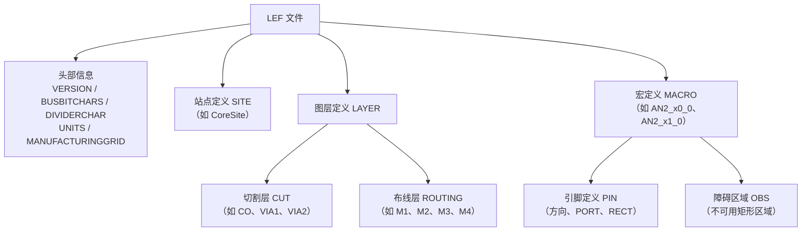

# LEF 格式的解析

## 1. LEF 概述

工艺库交换格式文件（Library Exchange Format，LEF）作为物理库描述格式，主要记录芯片物理设计相关信息，既包含如最小线宽、布线层数、金属线间距等布局布线规则，也描述库单元（cell）的物理属性，涵盖如逻辑门、触发器、运算单元等电路标准单元及 IP 核的物理尺寸与形状、管脚位置与类型、管脚与金属层的连接关系、驱动能力、负载能力、时序信息、方向和布局约束等，同时抽象了单元底层几何细节。文件中还涉及预定义的元器件宏块、工业库标准信息，以及芯片物理设计的大小、单位标准、各金属层的轨道分布和全局单元等，为芯片物理设计提供关键的工艺规则与单元物理模型，是连接工艺库与 EDA 工具的核心数据格式。

具体地，LEF 文件定义了一个集成电路工艺库，包括：

- 版本信息、单位定义、制造网格等基本信息。
- 站点定义，描述了芯片的基本单元布局。
- 图层定义，包括切割层和布线层，用于描述不同层次的几何形状和电气特性。
- 宏定义，描述了特定的电路模块（如 AN2_x0_0 和 AN2_x1_0），包括引脚和障碍区域。

这些信息是 IC 设计中布局和布线工具的基础，用于确保设计符合制造工艺的要求。

LEF 文件的整体结构如下图所示：



## 2. 宏单元

宏单元（MACRO）指的是在集成电路版图设计里，由多个标准单元或者特定功能模块组合而成的一个相对较大且具有特定功能的单元。它的内部已预先集成完整逻辑并预设大量引脚，但其对核（core）而言不可见。由于宏单元通常具有较多引线且功耗较高，在详细布线过程中需与标准单元引脚互联以实现线网连接，因此宏区域需要大量布线资源。它可以被视为一个独立的子模块，在设计和布局时会被当作一个整体来处理。

宏单元具有功能独立性、布局整体性、可复用性等特点，功能独立性使每个宏区域都能独立地完成一部分任务，布局整体性使其被作为一个整体进行布局和布线，可复用性使其可以在不同的芯片设计中重复使用，以缩短设计周期，降低设计成本。

LEF 文件中定义了宏单元，详细描述了它的形状大小、引脚位置、端口位置以及布线层。图 2-5 是一个宏单元在 LEF 文件中的定义，宏单元一般有很多引脚，这里只截取了一个引脚名为 Z。MACRO 命名为 AN2_x0_0，尺寸（SIZE）为 0.84×1.05，即宏区域的大小，ORIGIN 表示宏单元的原点，SITE 表示宏单元所在区域，RECT 表示宏单元中的引脚坐标信息，LAYER M1 表示在第一层金属层。基于布局文件中的宏单元位置信息，可确定其覆盖的网格区域。

```text
MACRO AN2_x0_0
  CLASS CORE ;
  FOREIGN AN2_x0_0 0.000 0.000  ;
  ORIGIN 0.000 0.000 ;
  SIZE 0.8400 BY 1.0500 ;
  SYMMETRY X Y ;
  SITE CoreSite ;
  PIN Z
    DIRECTION OUTPUT ;
    PORT
    LAYER M1 ;
    RECT 0.7275 0.1500 0.8025 0.9000 ;
    RECT 0.6975 0.1500 0.7275 0.3825 ;
    RECT 0.6975 0.6675 0.7275 0.9000 ;
    END
  END Z
```

**图 1 宏单元在 LEF 文件中的定义**

## 3. 格式解析

以下以 cn.lef 文件为例，介绍 LEF 文件的格式。

```text
VERSION 5.7 ;
BUSBITCHARS "[]" ;
DIVIDERCHAR "/" ;

UNITS
    DATABASE MICRONS 2000 ;
END UNITS
```

**1. 版本信息**

`VERSION 5.7 ;` 指定 LEF 文件的版本号为 5.7。

**2. 总线位字符**

`BUSBITCHARS "[]" ;` 定义总线位字符为 []，用于表示总线信号的位宽。

**3. 分隔符字符**

`DIVIDERCHAR "/" ;` 定义分隔符字符为 /，用于在名称中分隔层次结构。

**4. 单位定义**

```text
UNITS
    DATABASE MICRONS 2000 ;
END UNITS
```

- 定义数据库的单位为微米（MICRONS），并且 1 个数据库单位等于 2000 微米。

**5. 制造网格**

`MANUFACTURINGGRID 0.005 ;`

- 定义制造网格的最小单位为 0.005 微米。

### 站点（SITE）定义

**1. 站点定义**

```text
SITE CoreSite
    SIZE 0.210 BY 1.050 ;
    CLASS CORE ;
    SYMMETRY Y ;
END CoreSite
```

- 定义了一个名为 CoreSite 的站点。
- 站点大小为 0.210 微米×1.050 微米。
- 站点类型为 CORE，表示这是一个核心区域的站点。
- 站点具有 Y 轴对称性。

### 图层（LAYER）定义

**1. 切割层（CUT）**

```text
LAYER CO
    TYPE CUT ;
END CO
```

- 定义了一个名为 CO 的切割层，用于表示接触孔或通孔。

**2. 布线层（ROUTING）**

```text
LAYER M1
    TYPE ROUTING ;
    DIRECTION HORIZONTAL ;
    PITCH 0.15 0.150 ;
    OFFSET 0.000 0.000 ;
    WIDTH 0.050000 ;
END M1
```

- 定义了一个名为 M1 的布线层。
- 类型为 ROUTING，表示用于布线。
- 布线方向为水平（HORIZONTAL）。
- 布线间距（PITCH）为 0.15 微米×0.150 微米。
- 布线偏移（OFFSET）为 0.000 微米×0.000 微米。
- 布线宽度为 0.050 微米。

**3. 其他布线层和切割层**

- 文件中还定义了多个类似的布线层（如 M2、M3、M4 等）和切割层（如 VIA1、VIA2 等），每个层都有其特定的属性，如方向、间距、偏移、宽度等。

### 宏（MACRO）定义

**1. 宏定义**

```text
MACRO AN2_x0_0
    CLASS CORE ;
    FOREIGN AN2_x0_0 0.000 0.000  ;
    ORIGIN 0.000 0.000 ;
    SIZE 0.8400 BY 1.0500 ;
    SYMMETRY X Y ;
    SITE CoreSite ;
```

- 定义了一个名为 AN2_x0_0 的宏。
- 宏的类别为 CORE，表示这是一个核心宏。
- 宏的原点坐标为 (0.000, 0.000)。
- 宏的大小为 0.8400 微米×1.0500 微米。
- 宏具有 X 轴和 Y 轴对称性。
- 宏使用了 CoreSite 站点。

**2. 引脚（PIN）定义**

```text
PIN Z
    DIRECTION OUTPUT ;
    PORT
    LAYER M1 ;
    RECT 0.7275 0.1500 0.8025 0.9000 ;
    RECT 0.6975 0.1500 0.7275 0.3825 ;
    RECT 0.6975 0.6675 0.7275 0.9000 ;
    END
END Z
```

- 定义了一个名为 Z 的引脚。
- 引脚方向为 OUTPUT，表示这是一个输出引脚。
- 引脚的端口（PORT）定义在 M1 层上，由多个矩形（RECT）组成，每个矩形的坐标和尺寸分别指定。

**3. 其他引脚**

- 文件中还定义了其他引脚（如 A2、A1、VSS、VDD 等），每个引脚都有其方向、用途（如 INPUT、INOUT、POWER、GROUND 等）和几何形状。

**4. 障碍（OBS）定义**

```text
OBS
    LAYER CO ;
    RECT 0.7050 0.1800 0.7650 0.2400 ;
    RECT 0.7050 0.8025 0.7650 0.8625 ;
    ...
END
```

- 定义了障碍区域（OBS），这些区域在布局中是不可用的。
- 障碍区域定义在 CO 层上，由多个矩形组成，每个矩形的坐标和尺寸分别指定。
