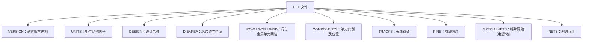

# DEF 格式的解析

## 1. DEF 概述

DEF（Design Exchange Format）文件是一种用于描述数字集成电路（IC）设计中物理布局的文件格式。它记录了电路设计在物理布局过程中的特定阶段的信息，描述的是实际的设计。DEF 文件使用特定的语法规范来描述这些信息，它在设计工具之间传递设计数据，特别是在布局布线（place-and-route）工具中。DEF 文件的作用包括逻辑设计数据和物理设计数据的传递，具体包括网络连接（netlist）、分组信息（grouping）、物理约束（physical constraints）、器件的位置和方向（placement locations and orientations）、布线几何数据（routing geometry）以及逻辑设计变化（用于 backannotation）。

DEF 文件的格式及语法说明通常包括以下几个方面：

1. **VERSION**：声明本 DEF 文件所使用的 DEF 语言版本，格式为“主版本号.次版本号[.子次版本号]”。例如 `VERSION 5.8 ;`。
2. **UNITS**：设置 DEF 文件中所有坐标、尺寸的单位比例因子，即定义 1 微米（μm）对应多少 DEF 单位（dbu）。例如 `UNITS DISTANCE MICRONS 1000 ;`。
3. **DESIGN**：声明设计名称，例如 `DESIGN chip_top ;`。
4. **DIEAREA**：定义芯片的边界区域，例如 `DIEAREA ( 0 0 ) ( 10000 10000 ) ;`。
5. **COMPONENTS**：列出所有调用的标准单元和宏，包括它们的名称、类型、位置坐标等。
6. **NETS**：描述元件之间的互联状况，展示每一条路径和使用的层。
7. **SPECIALNETS**：定义特殊网络，如电源和地线网络。

DEF 文件的整体结构如下图所示：



DEF 文件是芯片设计过程中，用于描述和传输设计物理信息的标准化文本格式。它为工程师提供了一个详细的布局蓝图，确保在不同的 EDA 工具之间共享设计时的一致性。

## 2. 文件结构分析

下面以 ispd19_test1.input.def 为例来说明 DEF 文件的统一格式。

**1、头部信息：**

### 1.1 版本和名称

```text
VERSION 5.8 ;
DIVIDERCHAR "/" ;
BUSBITCHARS "[]" ;
DESIGN ispd19_test1 ;
```

### 1.2 单位长度定义（坐标单位为微米，精度为 1/2000 微米）

```text
UNITS DISTANCE MICRONS 2000 ;
```

**2、布局信息**

### 2.1 芯片的物理边界

```text
DIEAREA ( 0 0 ) ( 296800 292000 ) ;
```

（0 0）为芯片左下角坐标，（296800 292000）为芯片右上角坐标。该句表示芯片长度为 296800 个单位，宽度为 292000 个单位。

### 2.2 定义标准单元的放置区域

```text
ROW CORE_ROW_0 CoreSite 2000 2000 FS DO 1464 BY 1 STEP 200 0 ;
ROW CORE_ROW_1 CoreSite 2000 4400 N DO 1464 BY 1 STEP 200 0 ;
ROW CORE_ROW_2 CoreSite 2000 6800 FS DO 1464 BY 1 STEP 200 0 ;
ROW CORE_ROW_3 CoreSite 2000 9200 N DO 1464 BY 1 STEP 200 0 ;
ROW CORE_ROW_4 CoreSite 2000 11600 FS DO 1464 BY 1 STEP 200 0 ;
ROW CORE_ROW_5 CoreSite 2000 14000 N DO 1464 BY 1 STEP 200 0 ;
```

ROW 指令创建规则排列的单元格，用于放置逻辑门（如 AND、OR、触发器等）。

- Core_row_0：行的标识符
- CoreSite：指定该行放置单元类型（在 LEF 文件中定义）
- 2000 2000：行的起始坐标（X=2000，Y=2000，X 在前）
- FS/N：行内单元方向（翻转朝南、朝北）。这决定了单元的引脚朝向和电路连接方式
- DO 1464 BY 1：行内包含 1464 个单元位置，间距为 1（1 不是指物理上的间距 1，只是表示排列的方式为紧密排列）
- STEP 200 0：相邻单元之间的步进值（X 方向步进 200，Y 方向步进 0）

该行宽度为：1464×200=292800 单位

该行长度为：4400-2000=2400 单位

### 2.3 定义全局单元网格

```text
GCELLGRID X 296100 DO 2 STEP 700 ;
GCELLGRID X 100 DO 149 STEP 2000 ;
GCELLGRID X 0 DO 2 STEP 100 ;
GCELLGRID Y 290200 DO 2 STEP 1800 ;
GCELLGRID Y 200 DO 146 STEP 2000 ;
GCELLGRID Y 0 DO 2 STEP 200 ;
```

GCELLGRID 指令用于定义全局单元网格，它将芯片区域划分为规则的网格单元。

- X/Y：X 代表水平方向，从左到右；Y 代表垂直方向，从下到上
- 296100：网格划分起始位置
- DO 2 STEP 700：划分 2 个网格，间距为 700

第一句表示：从水平坐标 X = 296100 开始，沿水平方向划分出 2 个网格单元，相邻网格单元间距为 700。

### 2.4 单元实例信息

```text
COMPONENTS 8879 ;
- inst8879 NOR4X4 + PLACED ( 38800 4400 ) N ;
- inst8878 BUFX6 + PLACED ( 289000 256400 ) FS ;
- inst8877 NOR4X4 + PLACED ( 283800 6800 ) FS ;
- inst8876 NAND4BX2 + PLACED ( 51000 285200 ) FS ;
- inst8875 NAND3X2 + PLACED ( 42200 280400 ) FS ;
```

- Components 8879：表示芯片中共有 8879 个单元实例。
- Inst8879：单元实例标识符，进行唯一标识。
- NOR4X4/BUFX6/NAND4BX2：单元类型，其中 NOR4X4 表明该单元是一个 4 输入或非门；BUFX6 表示这是一个缓冲器，“X6”可能表示其驱动强度等相关参数；NAND4BX2 4 是输入与非门，“BX2”可能代表特定的驱动强度等属性。单元具体信息在工艺库 LEF 文件中。
- PLACED（42200 280400）：PLACED 表示该单元实例在芯片上放置的位置
- N/FS：表示单元的放置方向

**3、布线信息**

### 3.1 特定金属层的布线轨道

TRACKS 指令格式：

```text
TRACKS <方向> <起始位置> DO <数量> STEP <间距> LAYER <金属层>
```

```text
TRACKS Y 200 DO 730 STEP 400 LAYER Metal9 ;
TRACKS X 500 DO 741 STEP 400 LAYER Metal9 ;
TRACKS X 500 DO 741 STEP 400 LAYER Metal8 ;
TRACKS Y 200 DO 730 STEP 400 LAYER Metal8 ;
TRACKS Y 200 DO 973 STEP 300 LAYER Metal7 ;
```

具体实例指令解释：

TRACKS 指令用于定义芯片中特定金属层的布线轨道，这些轨道是信号和电源网络布线的物理路径。

- X/Y：表示信号走向，X 表示水平走向，用于垂直信号走线（如连接上下层的过孔）；Y 用于水平信号走线（如连接左右单元的导线）。
- 200：轨道起始位置
- DO 730 STEP 400：向上延伸 730 条轨道，间距为 400
- LAYER Metal9：Metal9 通常是顶层金属，用于长距离全局布线（如时钟网络）

### 3.2 引脚相关信息

```text
PINS 0 ;
END PINS
```

在当前实例中，没有需要特别定义或描述的引脚。

### 3.3 特殊网格布线信息（电源、接地网络）

```text
SPECIALNETS 2 ;
- VSS  ( * VSS )
  + ROUTED Metal7 800 + SHAPE RING ( 500 100 ) ( * 291900 )
    NEW Metal7 800 + SHAPE RING ( 296300 100 ) ( * 291900 )
    NEW Metal8 800 + SHAPE RING ( 100 500 ) ( 296700 * )
    NEW Metal8 800 + SHAPE RING ( 100 291500 ) ( 296700 * )
    NEW Metal7 800 + SHAPE STRIPE ( 31500 0 ) ( * 292000 )
    NEW Metal7 800 + SHAPE STRIPE ( 71500 0 ) ( * 292000 )

- VDD  ( * VDD )
  + ROUTED Metal7 800 + SHAPE RING ( 1600 1200 ) ( * 290800 )
    NEW Metal7 800 + SHAPE RING ( 295200 1200 ) ( * 290800 )
    NEW Metal8 800 + SHAPE RING ( 1200 1600 ) ( 295600 * )
    NEW Metal8 800 + SHAPE RING ( 1200 290400 ) ( 295600 * )
```

- SPECIALNET 2：表示有两个特殊网络，一个是 VSS（接地网络），一个是 VDD（电源）
- ROUTED Metal7 800：表示该网络在 Metal7 金属层上布线，布线宽度为 800。
- SHAPE RING (500 100) (* 291900)：SHAPE 用于定义布线的几何形状，这里表示环形（RING）。（500 100）表示环形的起始坐标，（* 291900）表示在 X 方向上需要延伸，291900 是 Y 方向上的坐标值，即环形 Y 坐标结束位置。
- NEW Metal7 800：表示新的布线段，也在 Metal7 金属层上布线，布线宽度为 800。

### 3.4 网络与单元连线

```text
NETS 3153 ;
- net3153
  ( inst5747 SI )
;
- net3152
  ( inst3044 Y ) ( inst3045 A )
;
- net3151
  ( inst3855 Y ) ( inst3856 A )
;
- net3150
  ( inst3436 Y ) ( inst3437 A )
;
- net3149
  ( inst5512 Y ) ( inst5513 A )
```

- NETS 3153：定义网络数量为 3153 个
- net3153：网络名
- (inst5747 SI)：表示该网络连接到单元实例 inst5747 的 SI 引脚。
- Net 3152 (inst3044 Y) (inst3045 A)：net3152 连接到实例名为 inst3044 的单元的 Y 引脚以及实例名为 inst3045 的单元的 A 引脚。说明这两个单元的对应引脚通过 net3152 网络实现电气连接。inst3044 和 inst3045 组成了这个网络。
