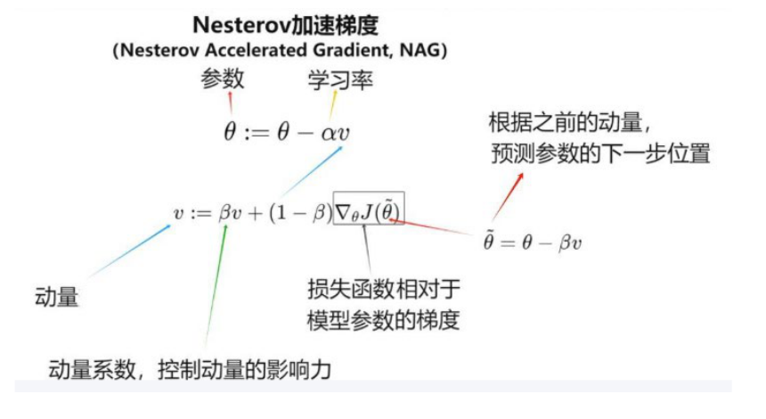
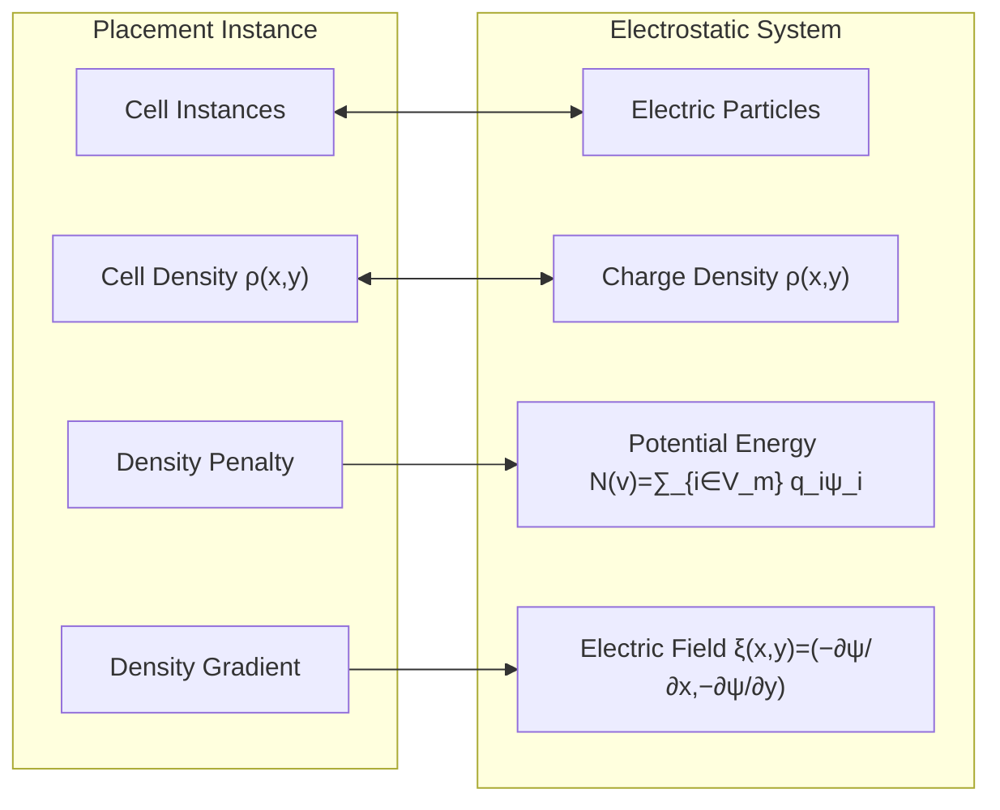

# 全局布局设计

## 1. 目标模型

采用文献[1]的全局布局算法。设计目标是在密度约束下得到最小线长，目标函数如下：

$$f(x, y)=\min \left(\sum_{e \in E} \mathrm{WL}(e ; x, y)\right)+\lambda \mathrm{D}(x, y) \tag{1}$$

其中，e 表示单个网络，E 则表示整个电路的所有网络；x，y 为网络中单元的位置矢量。WL(e;x,y)指单个网络的 HPWL，D(.)是密度惩罚项，权重 λ 用于控制密度约束。

输入：def 文件中的电路放置单元信息，包括单元放置位置以及引脚连接等。

输出：x，y 矢量

在优化过程中，λ 的值需要逐渐增加，从一开始主要关注线长最小化，逐渐过渡到同时考虑线长和密度的优化。

## 2. 最优化方法

目标函数 f(x,y)的求解采用 Nesterov（Nesterov's Accelerated Gradient, NAG）加速梯度法。该方法属于梯度下降法（Gradient Descent Algorithm）一类的方法。梯度下降法是优化领域的基础算法，其核心思想是沿目标函数负梯度方向迭代更新参数，每次迭代步长由学习率控制，但在高维非凸场景中易陷入局部最优、收敛缓慢；

### 2.1 梯度下降法

一、基本原理

假设我们有一个目标函数 J(θ)，其中 θ 是我们要优化的参数向量。我们的目标是找到一组参数 θ，使得目标函数 J(θ)达到最小值（如果是最大化问题，可以将其转化为最小化问题）。

梯度是一个向量，它指向函数在某一点上升最快的方向。对于函数 J(θ)，其在点 θ 处的梯度记为 ∇J(θ)。在二维情况下 $\nabla \mathrm{J}(\theta)=\left[\frac{\partial \mathrm{J}(\theta)}{\partial \theta_{1}}, \frac{\partial \mathrm{J}(\theta)}{\partial \theta_{2}}\right]$，其中 $\theta=\left[\theta_{1}, \theta_{2}\right]$。在高维情况下，梯度向量有更多的分量。

算法思想

梯度下降的基本思想是沿着目标函数的负梯度方向进行迭代搜索，因为负梯度方向是函数值下降最快的方向。每次迭代时，更新参数 θ，使其朝着可能使目标函数值更小的方向移动。

二、算法流程

- 初始化

首先，随机初始化参数 θ 的值。例如，在一个简单的线性回归问题中，如果有两个参数 $\theta_{0}$ 和 $\theta_{1}$，可以随机赋予它们一些初始值，如 $\theta_{0}=0，\theta_{1}=0$。

- 迭代更新

在每次迭代 t 中，按照以下公式更新参数：

$$\theta_{t+1}=\theta_{t}-\alpha \nabla \mathrm{J}\left(\theta_{t}\right)$$

其中，α 是学习率，它决定了每次迭代时参数移动的步长。如果 α 太小，收敛速度会很慢；如果太大，可能会导致算法无法收敛甚至发散。

- 停止条件

迭代过程会持续进行，直到满足某个停止条件。常见的停止条件包括：

  - 达到最大迭代次数。例如，设定最多迭代 1000 次。
  - 目标函数的变化小于某个阈值。
  - 梯度的范数小于某个阈值。

三、算法描述

1. 初始化参数：
   - 选择一个初始点 $x_{0}$。
   - 设置学习率 $\alpha$（步长），通常是一个小的正数。
   - 设置最大迭代次数 $T$ 或收敛阈值 $\epsilon$。
2. 迭代更新：
   - 对于 $t=0,1,2, \ldots, T-1$：
     1. 计算当前点的梯度：$g_{t}=\nabla f\left(x_{t}\right)$。
     2. 更新参数：$x_{t+1}=x_{t}-\alpha g_{t}$。
     3. 检查收敛条件：如果 $\left\|x_{t+1}-x_{t}\right\|<\epsilon$ 或 $\left\|g_{t}\right\|<\epsilon$，则停止迭代。

### 2.2. Nesterov 加速梯度法

Nesterov 加速梯度法（NAG）作为经典动量法的改进版，经典动量法在梯度下降法的基础上引入了动量（momentum）的概念，以加速收敛并减少振荡。NAG 法在每次更新参数时，不是直接在当前位置计算梯度，而是先利用动量预测参数的未来位置，然后在这个预估的位置上计算梯度。这种“前瞻式”更新方式使得 NAG 能够更快、更准确地更新参数。

经典动量法的算法描述：

1. 计算当前梯度：$g_{t}=\nabla f\left(x_{t}\right)$
2. 计算动量：$v_{t}=\beta v_{t-1}+(1-\beta) g_{t}$
3. 更新参数：$x_{t+1}=x_{t}-\alpha v_{t}$

Nesterov 加速梯度法（NAG）的算法描述：

1. 计算前瞻梯度：$g_{t}=\nabla f\left(\theta_{t}+\beta v_{t-1}\right)$
2. 计算动量：$v_{t}=\beta v_{t-1}+(1-\beta) g_{t}$
3. 更新参数：$\theta_{t+1}=\theta_{t}-\alpha v_{t}$

总结 NAG 算法图解如下：



$\theta:=\theta-\alpha v$

$v:=\beta v+(1-\beta)\nabla_{\theta}J(\tilde{\theta})$

$\tilde{\theta}:=\theta-\beta v$

## 3. 目标求解

### 3.1 单元拥挤程度建模（单元密度）

如参考文献[1]中所述，芯片全局布局 (Global Placement)里非常经典的静电类比 (Electro-static analogy)优化模型，把单元布放的密度均衡问题等价成一个静电物理系统求解。

每一个可移动的电路单元，等效成正电荷；电荷大小 = 单元自身的面积。把芯片单元当成带正电粒子；单元拥挤就如同电荷扎堆，产生排斥电场；利用静电排斥力驱动单元散开，不断迭代直到电荷（单元）密度均匀，也就是静电势能最低的平衡状态，从而完成密度均衡的全局布局优化。建模的示意图如下：



| 布局实例 Placement Instance | ↔ | 静电系统 Electrostatic System |
| --- | --- | --- |
| Cell Instances（待摆放逻辑单元 / 宏模块） | ↔ | Electric Particles（带电粒子，正电荷） |
| Cell Density $\rho(x, y)$ 单元面积密度分布 | ↔ | Charge Density $\rho(x, y)$ 电荷密度分布 |
| Density Penalty 密度惩罚项 | → | Potential Energy $N(\mathbf{v})=\sum q_{i} \psi_{i}$ 静电势能 |
| Density Gradient 密度梯度 | → | Electric Field $\boldsymbol{\xi}(x, y)=(-\partial \psi / \partial x,-\partial \psi / \partial y)$ 电场 |

### 3.2 算法描述

采用 Nesterov 的框架进行迭代，逐渐逼近目标。整个过程分为初始化和布局两个阶段。

**1. 初始化阶段**

1-1 填充单元 (Filler) 初始化（FillerInit）

计算可用空白区域、标准单元面积、Macro 面积；按照文献[1]公式计算需要插入的 filler 总面；选取中间 80% 模块的平均面积作为单个 filler 尺寸；生成若干 filler 单元并随机放置；把原始单元和 filler 合并到新的一个链表中 NodesAndFillers。

1-2. 密度 Bin 网格初始化（BinInit）

根据单元平均面积、目标密度计算 bin 网格维度；在布局区生成二维网格对象 bin，填充每个 bin 的坐标、宽高、中心、面积；计算每个 bin 的固定终端的密度为 *targetDensity* * 该网格与所有终端的重叠面积；计算每个 bin 中不能放置区域（即除 SiteRow 指定的可放置区域外的区域）的 `baseDensity` 为 *targetDensity* * 该网格与所有不能放置区域的重叠面积；

1-3. 梯度向量初始化（gradientVectorInitialization）

分配线长梯度矢量 wirelengthGradient 的大小为节点数目(标准单元+ Macro)；分配密度梯度矢量 densityGradient 与总梯度矢量 totalGradient 的大小均为 NodesAndFillers 数目（节点 + Filler）；分配 Filler 梯度矢量 fillerGradient 的大小为 Filler 的数目；

1-4. 总梯度更新（GetTotalGradient）

这是布局迭代前的第一次梯度计算。

1-4-1 更新 bin 内单元密度 nodeDensity，填充密度 fillerDensity；

1-4-2 更新密度梯度

1-4-3 更新线长梯度；

1-4-4 更新总梯度

1-5. 惩罚系数 lammda 初始化（penaltyFactorInitilization）

计算初始 HPWL；累加全部节点的线长梯度绝对值之和（numerator）；累加全部节点 + filler 的密度梯度绝对值之和(denominator)；令 lammda= numerator / denominator，得到 lammda 初始值，平衡两项梯度量级。

**2. 布局阶段**

```text
迭代 do{
    2-1．执行步骤 1-4 更新总梯度
    2-2．更新模块布局位置
    2-3．更新公式（1）中的 lammda
} While(迭代的停止判定)
```

**3. 迭代的停止判定**

（1）满足如下一个条件则停止迭代：

- 密度溢出率 τ 小于目标密度溢出率 $\tau_{\min }$
- 迭代次数大于规定最大迭代次数

（2）密度溢出率 τ 计算方法：

$$\tau=\frac{\text { 总溢出面积 }}{\text { 归一化总单元面积 }}$$

其中，

总溢出面积 $=\sum_{\mathrm{b} \in \mathrm{B}}$ 单网格的溢出面积 $_{\mathrm{b}}$，B为所有划分网格。

归一化总单元面积 = 标准单元总面积 + 宏单元总面积 * *targetDensity*

其中，

单网格的溢出面积 $_{\mathrm{b}}$ = b 网格布局元件面积 - *targetDensity* * 网格面积

其中 b 网格布局元件面积 = b 网格中(标准单元 + 宏单元 + 终端 + 暗节点)面积

如下是详细描述：

1-4 中的总梯度为：对公式（1）求导，得到目标函数梯度：

$$\nabla f(x, y)=\nabla \mathrm{WL}(x, y)+\lambda \nabla \mathrm{D}(x, y) . \tag{2}$$

要计算总梯度 ∇f，则需要分别计算线长梯度 ∇WL 和密度梯度 ∇D，再将结果线性相加。下面详细介绍其中的子步骤。

**步骤 1-4-2：更新密度梯度 ∇D(x,y)**

如前所述，将每个单元（标准单元、宏单元）建模为带电荷的粒子，电荷大小 q 等于单元的面积；电势 ψ 的梯度取负数就是电场 ξ。电荷间相互排斥，在电场力作用下将单元分开，通过最小化系统总电势能，最终达到静电平衡状态，即密度均匀分布。公式（1）密度惩罚代价被建模成静电系统的电势能。

对于点电荷系统，在已知电势 ψ 的情况下，电势能 D=电荷 q *电势 ψ，即 D=q*ψ。

公式（2）中密度（电势能）梯度 ∇D(x,y) 等于密度对 x,y 分别求导再相加：

$$\nabla \mathrm{D}(x, y)=\frac{\partial D}{\partial x}+\frac{\partial D}{\partial y} . \tag{7}$$

其中，$\frac{\partial D}{\partial x}$ 为密度在 x 方向上的梯度，$\frac{\partial D}{\partial y}$ 为密度在 y 方向上的梯度。

布局中存在多个单元，密度梯度等于每个单元密度梯度之和，即：

$$\frac{\partial D}{\partial x}=\sum_{i \in V} \frac{\partial D}{\partial x_{i}}, \frac{\partial D}{\partial y}=\sum_{i \in V} \frac{\partial D}{\partial y_{i}} . \tag{8}$$

V 为布局中所有单元集合。

单元 i 密度梯度计算公式为：

$$\frac{\partial D}{\partial x_{i}}=-q_{i} \xi_{i_{x}}, \frac{\partial D}{\partial y_{i}}=-q_{i} \xi_{i_{y}} . \tag{9}$$

其中 $q_{i}$ 为单元 i 的电荷大小，它等于单元 i 的面积，它是输入。布局区域被划分为 m × m 个网格，通过对每个网格内的标准单元、宏单元、填充单元的单元面积求和，得到单元 i 面积 $q_{i}$。$\xi_{x}$ 为电场 ξ 在 x 方向值，$\xi_{y}$ 为电场 ξ 在 y 方向值。

电势梯度 $\xi_{x}$、$\xi_{y}$ 计算公式为：

$$\xi_{x}(x, y)=\sum_{j=0}^{m-1} \sum_{k=0}^{m-1} \frac{a_{j, k} w_{j}}{w_{j}^{2}+w_{k}^{2}} \sin \left(w_{j} x\right) \cos \left(w_{k} y\right)$$

$$\xi_{y}(x, y)=\sum_{j=0}^{m-1} \sum_{k=0}^{m-1} \frac{a_{j, k} w_{k}}{w_{j}^{2}+w_{k}^{2}} \cos \left(w_{j} x\right) \sin \left(w_{k} y\right) \tag{10}$$

其中，$w_{j}$、$w_{k}$ 是频率分量，$a_{j, k}$ 是密度 ρ 的 DCT 系数：

$$a_{j, k}=\frac{1}{m^{2}} \sum_{x=0}^{m-1} \sum_{y=0}^{m-1} \rho(x, y) \cos \left(w_{j} x\right) \cos \left(w_{k} y\right) . \tag{11}$$

m*m 表示布局区域被划分网格数，ρ 表示网格中的单元密度，即网格内单元总面积\网格面积。

公式（10）的推导思路：用密度 ρ(x,y) 分布与电势 ψ 的关系，通过密度 ρ(x,y) 求电势 ψ，再对 ψ 求导得到电场力 ξ，其中，密度 ρ(x,y) 为已知量。

**步骤 1-4-2-1：统计各种单元的网格密度贡献**

对每一个节点（包括标准单元、宏单元、填充单元），统计与之有重叠的网格 bin[x][y]，并对每一个网格计算节点密度：

- 标准单元：

```cpp
bins[i][j]->nodeDensity += LengthScale.x * LengthScale.y *overlapArea;
```

- 宏单元：

```cpp
bins[i][j]->nodeDensity += LengthScale.x * LengthScale.y * targetDensity * overlapArea;
```

- 填充单元：

```cpp
bins[i][j]->fillerDensity += LengthScale.x * LengthScale.y * targetDensity * overlapArea;
```

其中，overlapArea 为该节点与网格的重叠面积，LengthScale.x 和 LengthScale.y 分别为 x 和 y 方向的长度拉伸，默认为 1，即不拉伸，当节点尺寸(x 或 y 方向) 小于网格大小时，

`LengthScale = 节点尺寸/网格大小`

**步骤 1-4-2-2：计算网格的总密度**

对每一个网格：`eDensity` = 总单元面积/网格面积

其中，总单元面积 = `bins[i][j]->nodeDensity` + `bins[i][j]->darkDensity` + `bins[i][j]->fillerDensity` + `bins[i][j]->terminalDensity`，`darkDensity` 与 `terminalDensity` 在初始化时求得，详见初始布局设计 3.2 节。

**步骤 2-2-3：计算 DCT 系数 $a_{j, k}$**

对于空间密度分布 ρ(x,y)，将其通过 DCT 转换到频域，其 DCT 系数 $a_{j, k}$ 为：

$$a_{j, k}=\frac{1}{m^{2}} \sum_{x=0}^{m-1} \sum_{y=0}^{m-1} \rho(x, y) \cos \left(w_{j} x\right) \cos \left(w_{k} y\right) \tag{20}$$

其中，$w_{j}$，$w_{k}$ 为频率分量，具体数值为 $w_{j}=\frac{j \pi}{m}$，$w_{k}=\frac{k \pi}{m}$；m 为划分网格数。

**步骤 1-4-2-4：计算逆 DCT 系数 ρ(x,y)**

逆 DCT 过程将频域信号转换为原始空间密度分布：

$$\rho(x, y)=\sum_{j=0}^{m-1} \sum_{k=0}^{m-1} a_{j, k} \cos \left(w_{j} x\right) \cos \left(w_{k} y\right) \tag{21}$$

其中，$w_{j}$，$w_{k}$ 为频率分量，其数值为 $w_{j}=\frac{j \pi}{m}$，$w_{k}=\frac{k \pi}{m}$；m 为划分网格数。

**步骤 1-4-2-5：计算电场 $\xi_{x}$、$\xi_{y}$**

对 ρ(x,y) 求导再取反，得到电场 $\xi_{x}$、$\xi_{y}$。

$$\xi_{x}(x, y)=\sum_{j=0}^{m-1} \sum_{k=0}^{m-1} \frac{a_{j, k} w_{j}}{w_{j}^{2}+w_{k}^{2}} \sin \left(w_{j} x\right) \cos \left(w_{k} y\right)$$

$$\xi_{y}(x, y)=\sum_{j=0}^{m-1} \sum_{k=0}^{m-1} \frac{a_{j, k} w_{k}}{w_{j}^{2}+w_{k}^{2}} \cos \left(w_{j} x\right) \sin \left(w_{k} y\right) .$$

其中，$a_{j, k}$ 是密度 ρ 的 DCT 系数。

注：其中第（4）和第（5）步可以用 FFT 包中的逆 SCT，逆 CST 来完成。

**步骤 1-4-2-6：计算密度梯度**

根据公式（8）和（9），运用电场 $\xi_{x}$、$\xi_{y}$ 计算得到密度梯度。

**步骤 1-4-3：更新线长梯度 ∇WL(x, y)**

公式（2）中线长梯度 ∇WL(x,y) 等于 WL 对 x、y 分别求导后再相加：

$$\nabla \mathrm{WL}(x, y)=\sum_{e \in E}\left(\frac{\partial \mathrm{WL}_{e}}{\partial x}+\frac{\partial \mathrm{WL}_{e}}{\partial y}\right) . \tag{3}$$

布局被划分为多个网络，E 为被划分网络的集合；$\frac{\partial \mathrm{WL}_{e}}{\partial x}$ 是单个网络线长 $\mathrm{WL}_{e}$ 在 x 方向的导数；$\frac{\partial \mathrm{WL}_{e}}{\partial y}$ 是单个网络线长 $\mathrm{WL}_{e}$ 在 y 方向的导数。

一个网络中存在多个引脚，单个网络线长梯度等于网络中所有引脚梯度之和：

$$\frac{\partial \mathrm{WL}_{e}}{\partial x}=\sum_{i \in e} \frac{\partial \mathrm{WL}_{e}}{\partial x_{i}}, \frac{\partial \mathrm{WL}_{e}}{\partial y}=\sum_{i \in e} \frac{\partial \mathrm{WL}_{e}}{\partial y_{i}} . \tag{4}$$

对于网络中的单个引脚 i，线长梯度计算公式为：

$$\frac{\partial \mathrm{WL}_{e}}{\partial x_{i}}=\frac{\left(1+\frac{x_{i}}{\gamma}\right) b_{e}^{+}-\frac{1}{\gamma} c_{e}^{+}}{\left(b_{e}^{+}\right)^{2}} \cdot a_{i}^{+}-\frac{\left(1-\frac{x_{i}}{\gamma}\right) b_{e}^{-}+\frac{1}{\gamma} c_{e}^{-}}{\left(b_{e}^{-}\right)^{2}} \cdot a_{i}^{-},$$

$$\frac{\partial \mathrm{WL}_{e}}{\partial y_{i}}=\frac{\left(1+\frac{y_{i}}{\gamma}\right) b_{e}^{+}-\frac{1}{\gamma} c_{e}^{+}}{\left(b_{e}^{+}\right)^{2}} \cdot a_{i}^{+}-\frac{\left(1-\frac{y_{i}}{\gamma}\right) b_{e}^{-}+\frac{1}{\gamma} c_{e}^{-}}{\left(b_{e}^{-}\right)^{2}} \cdot a_{i}^{-} . \tag{5}$$

其中，γ 是控制 WL 逼近实际线长的平滑度和精度的参数，通过以下方法计算：

$$\gamma=8.0 w_{b} \times 10^{20 / 9 \times(\tau-0.1)-1.0} . \tag{6}$$

公式（5）中，$w_{b}$ 为单个网格 b 的宽度；τ 为密度溢出率。

$b_{e}^{+}$、$c_{e}^{+}$、$b_{e}^{-}$、$c_{e}^{-}$、$a_{i}^{+}$、$a_{i}^{-}$ 的计算公式如下表格：

| Notation | Description | Notation | Description |
| --- | --- | --- | --- |
| $x_{e}^{+}$ | $\underset{i \in e}{\max } x_{i}, e \in E$ | $x_{e}^{-}$ | $\underset{i \in e}{\min } x_{i}, e \in E$ |
| $a_{i}^{+}$ | $e^{\frac{x_{i}-x_{e}^{+}}{\gamma}}, \forall i \in e, e \in E$ | $a_{i}^{-}$ | $e^{-\frac{x_{i}-x_{e}^{-}}{\gamma}}, \forall i \in e, e \in E$ |
| $b_{e}^{+}$ | $\sum_{i \in e} a_{i}^{+}, \forall e \in E$ | $b_{e}^{-}$ | $\sum_{i \in e} a_{i}^{-}, \forall e \in E$ |
| $c_{e}^{+}$ | $\sum_{i \in e} x_{i} a_{i}^{+}, \forall e \in E$ | $c_{e}^{-}$ | $\sum_{i \in e} x_{i} a_{i}^{-}, \forall e \in E$ |

**步骤 2-3：更新 lammda**

$$\lambda_{k}=\mu_{k} \lambda_{k-1} \tag{37}$$

其中 $\mu_{k}=1.1^{-\left(\Delta \mathrm{HPWL}_{k} / \Delta \mathrm{HPWL}_{\mathrm{REF}}\right)+1.0}$；$\Delta \mathrm{HPWL}_{\mathrm{RFF}}=3.5 \times 10^{5}$，$\Delta \mathrm{HPWL}_{k}=\mathrm{HPWL}\left(\vec{v}_{k}\right)-\mathrm{HPWL}\left(\vec{v}_{k-1}\right)$。

通过公式（37）动态更新 λ，可以平衡线长和密度的优化优先级。

### 3.3 输出线长

HPWL（Half-Perimeter Wirelength）是布局中常用的线长估计方法，用于快速评估电路模块间的连线复杂度。其核心思想是通过计算模块边界框（Bounding Box）的周长的一半来近似线长。

HPWL 计算公式为：

$$\mathrm{HPWL}=\sum_{e \in E}\left(\max _{i, j \in e}\left|x_{i}-x_{j}\right|+\max _{i, j \in e}\left|y_{i}-y_{j}\right|\right) . \tag{38}$$

其中，e 表示单个网络，$x_{i}$ 表示该网络中的引脚 i 的 x 方向坐标，$y_{i}$ 表示该网络中的引脚 i 的 y 方向坐标。

实现：

```text
对每一个 net
{
    遍历所有 pin,
        {  寻找 minX、maxX、minY、maxY; }
}
HPWL = ((maxX - minX) + (maxY - minY)
```

## 参考文献

[1] J. Lu, P. Chen, C.-C. Chang, L. Sha, D. J.-H. Huang, C.-C. Teng, and C.-K. Cheng, “ePlace: Electrostatics-based placement using fast fourier transform and nesterov’s method,” ACM TODAES, vol. 20, no. 2, p. 17, 2015.

[2] J. Lu, H. Zhuang, P. Chen, H. Chang, C.-C. Chang, Y.-C. Wong, L. Sha, D. Huang, Y. Luo, C.-C. Teng et al., “ePlace-MS: Electrostatics-based placement for mixed-size circuits,” IEEE TCAD, vol. 34, no. 5, pp. 685–698, 2015.
