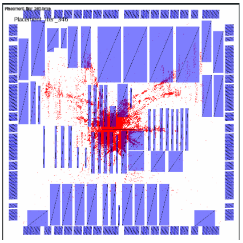
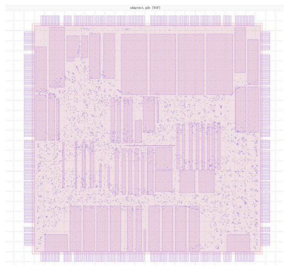

# 布局结果可视化

## 1. 借助 CImg 库绘制图像

### 1.1 坐标系

有两种坐标系，数学坐标系（笛卡尔坐标系）和屏幕坐标系（像素坐标系）。

1. 数学坐标系：

原点 (0,0) 在左下角，Y 轴向上为正方向，这是在数学、物理、工程中熟悉的坐标系。

2. 屏幕坐标系：

原点 (0,0) 在左上角，Y 轴向下为正方向这是大多数图形 API（如 Cairo、OpenGL、Skia、HTML Canvas、Qt、PDF 等）使用的坐标系。

所以，数据中使用的数学坐标系（比如 y=0 在左下角），但要把它画在屏幕上，就必须反转 Y 轴。

### 1.2 布局坐标

在布局中，采用数学坐标系，即原点（0，0）在左下角，涉及一些对象坐标：

（1）布线行 SiteRow

这是*.scl 文件定义的布线行

（2）布局区域 CoreRegion.，SiteRow 的最小外包矩形

CoreRegion.ll：矩形左下角（x,y）

CoreRegion.ur：矩形右上角（x,y）

（3）芯片区域 ChipRegion，包含 CoreRegion 和所有终端的最小外包矩形，画图时，显示该区域。

（4）节点 Node 坐标

Node.ll：矩形左下角（x,y）

Node.ur：矩形右上角（x,y）

### 1.3 绘图

CImg 库在 C++ 图像处理领域是一个常用的工具。仅由一个头文件 CImg.h 组成，无需复杂安装，不依赖 OpenCV、ImageMagick 等，可独立运行，便于部署，且支持图像加载/保存、滤波、几何变换、绘图、颜色空间转换、3D 可视化等。

可用 CImg 库绘制布局结果，参考代码 MyPlacement_v2.0_plot.zip。

`void PLOTTING::plotPlacement(string imageName, PlaceData *db)`

其中，设当前的 Node 坐标为 curNode->ll 与 curNode->ur，则待绘制的坐标相对坐标：（Node 坐标-ChipRegion 坐标），注意为转换为屏幕坐标系，y 方向需翻转。另外，画图坐标等于实际坐标乘以放缩比例 unitX,uniteY+周边预留的空白 xMargin，yMargin。

```cpp
int x1 = (curNode->getLL_2D().x -db->chipRegion.ll.x) *unitX + xMargin;
int x2 = (curNode->getUR_2D().x -db->chipRegion.ll.x) *unitX + xMargin;

int y1 = (chipRegionHeight-(curNode->getLL_2D().y -db->chipRegion.ll.y) ) * unitY + yMargin;
int y2 = (chipRegionHeight-(curNode->getUR_2D().y -db->chipRegion.ll.y) ) * unitY + yMargin;
```

结果示例：



## 2. 借助 KLayout 工具观测图像

步骤 1：下载并安装 KLayout 工具

步骤 2：将布局结果输出为 GDSII 格式文件

步骤 3：KLayout 中打开 GDSII 格式文件

结果示例：


